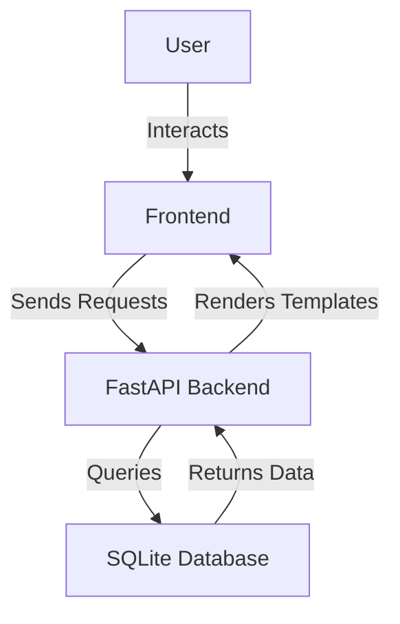

# Decentralized Finance Portfolio Analyzer

## Overview
The Decentralized Finance Portfolio Analyzer is a robust web application tailored for cryptocurrency investors seeking a streamlined approach to managing and analyzing their digital asset portfolios. This application provides a centralized dashboard where users can efficiently track their cryptocurrency assets, review transaction histories, and manage their profiles. By leveraging FastAPI for a responsive backend and SQLite for lightweight database management, this tool offers an efficient solution for cryptocurrency enthusiasts, traders, and investors who need to monitor their investments and make informed decisions based on the performance of their portfolios.

The application is designed with a responsive frontend using Jinja2 templates, ensuring that users can access their portfolio information seamlessly across various devices. This makes it an ideal choice for users who require mobility and flexibility in managing their investments.

## Features
- **User Authentication**: Secure login mechanism with password hashing to protect user data.
- **Portfolio Dashboard**: A user-friendly interface displaying an overview of the user's cryptocurrency assets.
- **Asset Management**: Add, view, and manage different cryptocurrency assets within the portfolio.
- **Transaction History**: Access detailed transaction history to track asset movements and trends.
- **Profile Management**: Update and manage user profile settings easily.
- **Responsive Design**: Mobile-friendly layout ensuring accessibility on various devices.
- **API Access**: Comprehensive API endpoints for integrating with other applications or services.

## Tech Stack
| Component      | Technology       |
|----------------|------------------|
| Backend        | FastAPI          |
| Frontend       | Jinja2 Templates |
| Database       | SQLite           |
| Password Hashing | Passlib (bcrypt) |
| Server         | Uvicorn          |
| Styling        | CSS, Bootstrap   |

## Architecture
The application is structured with a clear separation between the backend and frontend components. The backend, built with FastAPI, handles API requests and interacts with the SQLite database. The frontend is served using Jinja2 templates, dynamically generating HTML pages based on user interactions.



## Getting Started

### Prerequisites
- Python 3.11+
- pip (Python package installer)
- Docker (optional for containerized deployment)

### Installation
1. Clone the repository:
   ```bash
   git clone https://github.com/yourusername/decentralized-finance-portfolio-analyzer-auto.git
   cd decentralized-finance-portfolio-analyzer-auto
   ```
2. Create a virtual environment:
   ```bash
   python3 -m venv venv
   source venv/bin/activate # On Windows use `venv\Scripts\activate`
   ```
3. Install the required packages:
   ```bash
   pip install -r requirements.txt
   ```

### Running the Application
1. Start the FastAPI server:
   ```bash
   uvicorn app:app --host 0.0.0.0 --port 8000
   ```
2. Open your browser and visit:
   ```
   http://localhost:8000
   ```

## API Endpoints
| Method | Path              | Description                           |
|--------|-------------------|---------------------------------------|
| GET    | `/`               | Render the dashboard page.            |
| GET    | `/assets`         | Render the assets management page.    |
| GET    | `/history`        | Render the transaction history page.  |
| GET    | `/profile`        | Render the user profile page.         |
| GET    | `/api/assets`     | Retrieve all assets for the user.     |
| POST   | `/api/assets`     | Add a new asset to the portfolio.     |
| GET    | `/api/history`    | Retrieve all transaction history.     |
| POST   | `/api/auth/login` | Authenticate user and return token.   |
| GET    | `/api/profile`    | Retrieve user profile information.    |

## Project Structure
```
.
├── Dockerfile             # Docker configuration file for containerization
├── app.py                 # Main application file with FastAPI setup
├── requirements.txt       # Python dependencies
├── start.sh               # Shell script to start the application
├── static                 # Static files directory
│   ├── css
│   │   └── style.css      # Stylesheet for the application
│   └── js
│       └── main.js        # JavaScript for frontend interactions
├── templates              # HTML templates for rendering pages
│   ├── assets.html        # Template for assets management page
│   ├── dashboard.html     # Template for dashboard page
│   ├── history.html       # Template for transaction history page
│   └── profile.html       # Template for user profile page
└── test.db                # SQLite database file (auto-generated)
```

## Screenshots
*Screenshots of the application will be placed here to showcase the UI and features.*

## Docker Deployment
1. Build the Docker image:
   ```bash
   docker build -t defi-portfolio-analyzer .
   ```
2. Run the Docker container:
   ```bash
   docker run -p 8000:8000 defi-portfolio-analyzer
   ```

## Contributing
Contributions are welcome! Please fork the repository and submit a pull request for any feature additions or bug fixes. Ensure your code adheres to the project's coding standards and includes relevant tests.

## License
This project is licensed under the MIT License.

---
Built with Python and FastAPI.